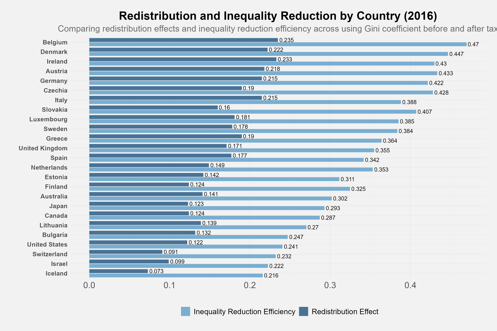

# TidyTuesday
My weekly TidyTuesday data visualization contributions using R

## About TidyTuesday
TidyTuesday is a weekly social data project that focuses on understanding how to summarize and arrange data to make meaningful charts with `ggplot2`, `tidyr`, `dplyr`, and other tools in the `tidyverse` ecosystem.

## 2025 Contributions

### Week 32 - Income Inequality (2025-08-05)

### All 2025 Contributions

| Week | Dataset | Code | Plots |
|------|---------|------|-------|
| [32](025/2025-08-05/) | Income Inequality | [📝](025/2025-08-05/TidyTuesday_Income_Inequality.Rmd) | [📊](2025/2025-08-05/Income_Inequality.png) |
| [32](025/2025-08-05/) | Income Inequality | [📝]TidyTuesday_Income_Inequality.Rmd (025/2025-08-05/TidyTuesday_Income_Inequality.Rmd) | [📊] Income_Inequality.png (2025/2025-08-05/Income_Inequality.png)) |

